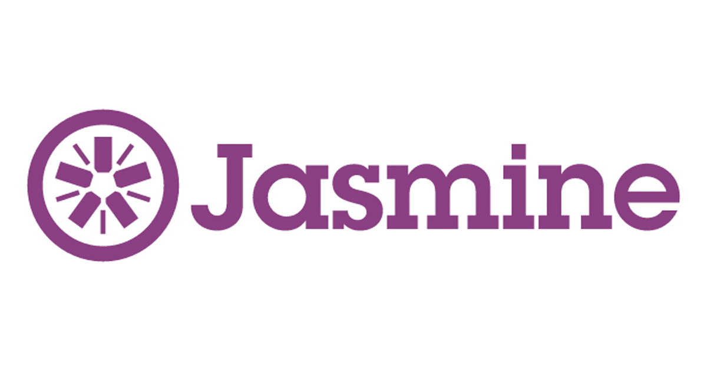

# Javascript Unit testing with Jasmine

_ December 2021_

> 🔨 From udemy: [Unit testing your Javascript with jasmine - Martynas Vanagas](https://www.udemy.com/course/unit-testing-your-javascript-with-jasmine/).

---

Jasmine is a behavior-driven development framework for testing JavaScript code. It does not depend on any other JavaScript frameworks. It does not require a DOM. And it has a clean, obvious syntax so that you can easily write tests.

## Unit testing

**What?**

● Testing individual units of code.
● Unit is the smallest testable part (function).

**Why?**

● Trust changes you make on existing (already tested) code.
● Code quality
● Changes occur quickly
● Documents your own code
● Automation

**Why jasmine?**

● Everything comes out of the box

## Concepts covered

## useful links

- [Jasmine](https://jasmine.github.io/)
- [jasmine/jasmine](https://github.com/jasmine/jasmine)
- [Getting strated with Jasmine](https://itenium.be/blog/javascript/javascript-testing-jasmine-getting-started/)
- [juanlizarazo/jasmine-casts](https://github.com/juanlizarazo/jasmine-casts)
- [ReyPena/jasmine-casts](https://github.com/reypena/jasmine-casts)
